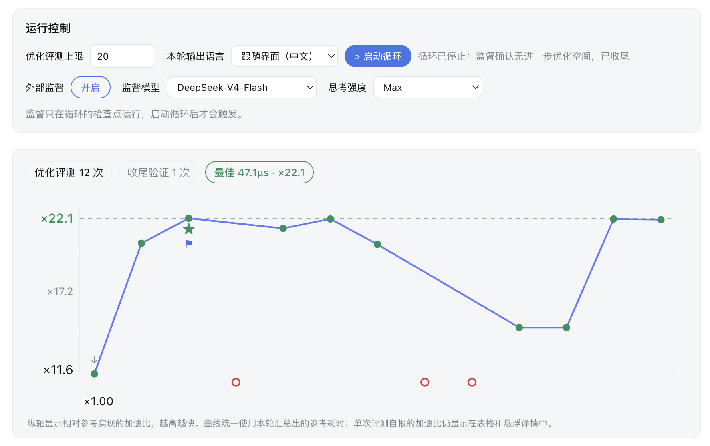

<h1 align="center">dsh-kernel-opt</h1>
<p align="center"><b>DeepSeek Harness 插件：实时查看并干预算子优化过程</b></p>
<p align="center">简体中文 | <a href="README.en.md">English</a></p>

<p align="center">
  <a href="https://github.com/xieTwim/dsh-kernel-opt/actions/workflows/ci.yml"></a>
  <a href="LICENSE"></a>
  <a href="https://github.com/deepseek-ai/deepseek-harness"></a>
</p>

<p align="center"><b>觉得有用的话，欢迎点个 star 🌟</b></p>

<p align="center">
  
  <br/>
  <i>RoPE <code>(4, 32, 4096, 128)</code> fp16，单卡 NVIDIA B200。12 次评测，加速比从 ×1.00 到 ×22.1，全程除以同一个参考耗时（冻结在 1.0400 ms）。3 次失败也画在图上。最后一次是插件自己重跑那条评测命令得到的 47.3 µs，本轮自报的最好成绩为 47.1 µs。</i>
</p>

## News

- 🚀 **[2026.08.17]** **dsh-kernel-opt 开源发布**：实时评测面板、按预算运行并自行收尾的优化循环，以及可选的第二模型监督。

**目录**

- [简介](#简介)
- [安装](#安装)
- [快速开始](#快速开始)
- [接入你自己的评测](#接入你自己的评测)
- [循环](#循环)
- [文档](#文档)
- [兼容性](#兼容性)
- [许可](#许可)
- [致谢](#致谢)

## 简介

**dsh-kernel-opt 是 [DeepSeek Harness](https://github.com/deepseek-ai/deepseek-harness)（DSH）的插件。算子优化要跑很多轮，它把每一轮的评测结果实时画进同一个会话，人可以边看边介入。**

模型一轮轮地读代码、改代码、跑评测，同一个会话里多出一个「评测」页签，实时显示：加速比曲线（越高越快）、每个点的正确性与是否奖励作弊（reward hack）、**每个点的来源及其可信程度**、性能分析 ▲ ／当前最优 ★ ／收尾 ⚑ 三种标记、模型当前的方案，以及监督模型的意见。随时可以发消息改变方向，和平时用 DSH 一样。模型换思路时，可以压缩自己的上下文后继续。

面板显示的内容全部**从会话日志投影而来**，插件不另存一份，所以回放一个会话，画面与当时实时看到的一致。

**评测命令在哪台机器上执行，GPU 就在哪里**：本机、容器、投到集群的作业都可以。插件本身不需要 GPU。

## 安装

安装需要 DeepSeek Harness，以及 **`PATH` 中有 pnpm**——`dsh plugin` 会把参数转发给 pnpm。面板属于 DSH 的 **web** 界面，所以插件要装进 web profile。

插件本身不需要构建，`lib/` 已经提交进仓库。

```sh
# 仓库是公开的，不需要凭据
dsh plugin --profile web add "github:xieTwim/dsh-kernel-opt"

# 或者钉住某个 commit，使安装可复现
dsh plugin --profile web add "github:xieTwim/dsh-kernel-opt#<commit-sha>"

# 或者安装本地 checkout，用于开发
dsh plugin --profile web add /path/to/dsh-kernel-opt
```

如果还没有 `dsh`，上面的命令可以走 npx：`npx -p @deepseek-ai/dsh dsh plugin …`，启动则是 `npx -p @deepseek-ai/dsh dsh web`。

升级时用新的 sha 再执行一次 `add`。

重启 `dsh web`，然后验证：

```sh
dsh --profile web --dump-config | grep kernel-opt   # 应该能看到这个插件
```

## 快速开始

1. **安装插件**，重启 `dsh web`。
2. **把算子放进工作目录。** 参考实现、输入数据、你自己的评测脚本都是可选的，形式不限，模型会自己确认有哪些材料并把评测接起来。没有参考实现时，最初那版算子会被冻结为分母。连评测脚本也没有时，使用**内置评测器**：检查正确性、取中位数计时、每次换新的输入值，并用一项检查识别重放缓存答案的实现，参考实现只计时一次然后冻结。它运行在 Python 与 PyTorch 上，**执行评测的那台机器**需要有 CUDA GPU。
3. **新建一个「算子优化模式」的会话**，告诉它三件事：算子在哪、怎么评测、预算和硬件。也可以直接用 `/kloop 30` 交给循环。
4. **打开会话顶部的「评测」页签**，曲线、状态、方案、监督都在这里。随时发消息即可改变方向。

「算子优化模式」是插件写入 `~/.dsh/.agent-presets/kernel-opt/` 的一个 agent preset，每次启动时同步到当前插件版本；你手动改过的文件不会被覆盖，`preset.install: false` 可以整个关闭。插件添加的工具和命令**只存在于这个模式**，其他会话不会加载。

→ [`docs/mode.md`](docs/mode.md)

## 接入你自己的评测

**面板对评测方式不做任何假设。** 你自己的脚本、现成的评测器、投到远端机器的作业，只要往 stdout 打印一行，就成为曲线上的一个点：

```
KERNEL_EVAL={"artifact":"solution/kernel.py","latency_ms":1.23,"correct":true}
```

**必需**：`artifact`（测的是哪个文件）与 `correct`。**测到延迟时带上 `latency_ms`**。**可选**：`compiled`、`error`、`native_metrics`（数值映射）、`reward_hack_detected`、`advisory`、`workload_indices`。一行一个评测，从行首开始，JSON 之后可以跟其他字符。

评测器本身就是**工具**（MCP 或注册工具）时不需要打印这一行，它结果文本中的同名字段直接进入面板。名称中含 `kernel_evaluate` 的工具默认收录，其余的写进 `benchTools` 配置。

每个点都记录了来源，面板直接显示出来：自报的点会附上产生它的那条命令；模型收尾时，插件会自己把那条命令重跑一遍。**过程由模型自报，最终数字由插件复测。** 复测不是无条件的：可以关闭，记录下来的命令超过 300 字符也无法复测，这两种情况下面板会标明最终数字未经复测。

→ 全部字段、信任级、统一分母（以及缺少它会如何影响整轮的可比性）、去重规则：[`docs/eval-contract.md`](docs/eval-contract.md)

## 循环

```sh
/kloop            # 启动；默认预算 20 次评测（/kloop 30 可指定）
/kloop stop       # 停止（/kloop status 查看状态）
/supervise on     # 打开第二模型复审
/supervise use deepseek-official/deepseek-v4-flash   # 为本会话指定复审模型
```

也可以完全在界面里操作：在面板上，或在输入框旁边的启动器里，开关和配置循环；循环运行时那里还会显示轮次与预算进度。两条路径驱动的是同一份状态。

启动一轮运行时会固定这一轮的输出语言，并从复审模型实际支持的档位中选择思考强度。预算只计优化评测：收尾时的验证，以及模型在同一个回合（turn）内多做的那次评测，都会保留并单独显示，不计入预算。

每个回合结束后，循环检查当前进展。模型已经收尾就停止；预算用完、或连续两轮没有新评测，则先要求一次收尾（把最优版本装回去、在它上面 finalize、做出总结），之后停止；其余情况推动模型继续，并把剩余预算、停滞轮数和复审意见一并带上。

**人发出的停止优先于循环的自动续跑**：停止按钮、`/kloop stop`、以及中断一个回合，都会立刻停掉循环，不做收尾。你发送的消息也优先于循环本来要发的内容。

**监督**是把一份运行摘要交给第二个模型：预算、方案、评测表，以及**最近几行背后的真实改动**。它评判的是这一轮的运行方式——正确性是否排在速度之前、预算花得是否合理、是否试过不止一族方法、是否做过性能分析、每个自报点的命令行是否像真实评测、diff 与它自称的方案是否一致。它读的是这些改动，不是整份算子代码；算子本身对不对、快不快，由评测器用实测回答。**复审没有结论，不等于通过**：复审失败、超时、或没有给出任何答复，这一轮就不留复审记录，也不会阻塞循环。

→ [`docs/loop.md`](docs/loop.md)

## 文档

| 文档 | 内容 |
|---|---|
| [`docs/eval-contract.md`](docs/eval-contract.md) | 评测契约全文：两条通道、全部字段、信任级、finalize 复测、统一分母、去重规则 |
| [`docs/mode.md`](docs/mode.md) | 算子优化模式：它让模型做什么、往会话里加了什么、面板显示什么、内置评测器、以及它安装了哪些文件 |
| [`docs/loop.md`](docs/loop.md) | 循环与监督：每一轮怎么判定、空会话如何启动、复审模型如何选择、复审能查出和查不出什么 |
| [`docs/config.md`](docs/config.md) | 全部配置项，以及 HTTP 接口 |
| [`docs/limits.md`](docs/limits.md) | 已知边界，按对面板判读的影响程度排序 |
| [`docs/development.md`](docs/development.md) | 开发、插件如何注册自己、支持的宿主版本与 semver、CI |

## 兼容性

在 DeepSeek Harness **0.1.0-rc.6** 上测试。插件用到了 2026-08-11 那次改名引入的宿主 API（`httpServer→webServer`、`compact→compaction`），**更旧的宿主无法加载**。peer 范围是对 DSH 的各个分包分别声明的，而不是对 `@deepseek-ai/dsh` 整体，原因见 [`docs/development.md`](docs/development.md#peer-范围为什么是两段式)。

## 许可

MIT，见 [`LICENSE`](LICENSE)。

## 致谢

- **[AKO4ALL](https://github.com/TongmingLAIC/AKO4ALL)**：插件的内置评测器（`preset/kernel-opt/evaluator/bench.py`）由 AKO4ALL 附带的评测脚本改写而来。
- **[KernelBench](https://github.com/ScalingIntelligence/KernelBench)**：AKO4ALL 的脚本内联了它的核心评测逻辑，因此它也传到了这里。

两者都是 MIT，许可声明原样收录在 [`THIRD_PARTY_NOTICES.md`](THIRD_PARTY_NOTICES.md) 与文件头部。
